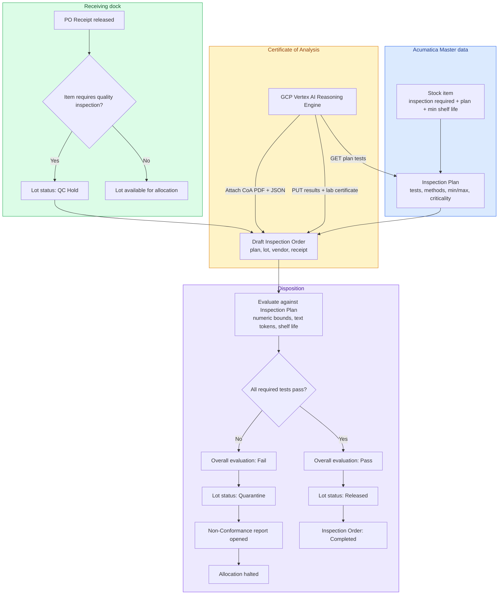

# Acumatica QMS Customization (`acu-custom-qms`)

Acumatica Cloud xRP customization package **`Lab5.QMS`**. It adds a Quality
Management workspace to Acumatica so a receiving dock cannot put inspected
goods into production until laboratory results pass the item’s inspection
plan.

Standard Acumatica Distribution and Manufacturing editions do not ship a
Quality Management module. This package is the ERP-side system of record
for:

- Inspection plans (what must be tested, and the pass bounds)
- Dock-receipt quarantine (lot held on PO Receipt release)
- Certificate of Analysis (CoA) result ingestion
- Automated lot disposition (Released or Quarantine)
- Non-conformance reports (NCR) when a lot fails

It is built for **Health Canada GMP (GUI-0001 / GUI-0158)** and **21 CFR
Part 11** raw-material release: the inspection order plus the attached CoA
PDF and parsed JSON is the audit record for the lot.

Companion repositories (not implemented here):

- [`acu-google-qms`](https://github.com/kborovik/acu-google-qms) — GCP CoA
  ingestion and reasoning engine
- [`acu-gitops-qms`](https://github.com/kborovik/acu-gitops-qms) — CanNordic
  tenant GitOps seed (inventory, IN/PO preferences, users)

Shipped artifact: `Lab5_QMS_Customization.zip`. REST contract used by the
ingestion engine: **`QMS/22.200.001`**.

## Purpose

On dock arrival, inspected stock must not be allocatable to a bill of
materials until quality has signed it off. The package enforces that gate
inside Acumatica:

1. A stock item is flagged **Requires Quality Inspection** and linked to an
   **Inspection Plan** (plus an optional minimum remaining shelf life).
2. When a **PO Receipt** is released, every lot on those lines is set to
   **QC Hold** and a draft **Inspection Order** is opened (plan, lot,
   vendor, receipt).
3. The ingestion engine reads the plan, writes laboratory results onto the
   order, and attaches the original CoA PDF and JSON payload.
4. **Evaluate** compares each required test to the plan. All pass, then the
   lot is **Released** and the order **Completed**. Any required fail or
   missing result, then the lot is **Quarantine**, a **Non-Conformance**
   ticket is opened, and allocation stays blocked.

QC Hold becomes Released only as role **Quality Manager** or as the
ingestion service account.

## Business workflow



Lot status on inspected receipts is one of **QC Hold**, **Released**, or
**Quarantine**. The receipt number, lot serial, and inspection order stay
linked for the life of the lot.

## Entities

Five custom records plus three fields on the stock item.

| Record | Role |
| --- | --- |
| Inspection Plan | Quality specification for an item: sampling, revision, effective date |
| Inspection Plan Test | One test line: method, target, min/max, UOM, criticality, required |
| Inspection Order | Execution record for one received lot |
| Inspection Order Result | Actual lab value against one plan test |
| Non-Conformance | OOS ticket, quarantine hold, root cause and disposition |
| Stock item (extension) | Flags the SKU into the dock gate |

### Stock item

| Field | Description |
| --- | --- |
| Requires Quality Inspection | When true, PO Receipt release holds the lot and opens a draft order |
| Inspection Plan | Default active plan for this SKU |
| Min. Receiving Shelf Life (Days) | Lot expiry must be at least receipt date plus this many days |

### Inspection Plan

| Field | Description |
| --- | --- |
| Plan ID | Unique uppercase id (example: `QPLAN-BOT-ECH4`) |
| Description | Title of the plan |
| Inventory ID | Linked stock item |
| Sampling Plan | Sampling standard (example: ISO 2859-1 Level II Normal) |
| Status | Active, Hold, or Inactive |
| Revision | Integer version (default 1) |
| Effective Date | Date the plan is legally in force |

Plan tests:

| Field | Description |
| --- | --- |
| Line Nbr | Sequence (10, 20, 30, …) |
| Test ID | Code (assay, heavy metal, micro, …) |
| Description | Human-readable test name |
| Test Method | Analytical standard (example: ICP-MS, USP 2232) |
| Target / Min / Max | Nominal and allowable numeric bounds (bounds nullable) |
| UOM | SI unit (`% (w/w)`, `ppm`, `CFU/g`) |
| Criticality | Critical, Major, or Minor (default Critical) |
| Required | Must appear on the CoA before release (default true) |

If both min and max are set, min must be less than or equal to max.

### Inspection Order

Auto-numbered (`QORD`). One order per held lot.

| Field | Description |
| --- | --- |
| Inspection Order Nbr | Auto-number |
| Status | Open (pending ingestion), Completed, Cancelled |
| Inventory ID / Lot / Vendor / Receipt | The received lot |
| Plan ID | Plan used for this evaluation |
| Testing Lab / Lab Certificate Nbr | Laboratory identity and CoA number |
| Inspection Date | Date of evaluation |
| Overall Evaluation | Pending, Pass, or Fail |
| Evaluated By / Evaluation Date-Time | Who signed the evaluation, and when |

Result lines (one per plan test):

| Field | Description |
| --- | --- |
| Line Nbr / Test ID / Test Method | Matches the plan line |
| Target Spec | Textual spec as shown on the CoA (example: `<= 0.50 ppm`) |
| Actual Numeric / Actual Text | Normalized SI value and the lab’s original string |
| Evaluation | Pass, Fail, or Skipped |
| Notes | Auditor or engine notes (UoM conversion, anomalies) |

### Non-Conformance (NCR)

Auto-numbered (`QNCR`). Opened automatically on a failed evaluation.

| Field | Description |
| --- | --- |
| NCR Nbr | Auto-number |
| Status | Open, In Investigation, Closed, Void |
| Inspection Order / Item / Lot / Vendor / Receipt | Failed lot |
| Severity | Critical, Major, or Minor |
| Type / Root Cause | Category of defect and cause class |
| Assigned QA Officer | Investigator |
| Description / Action Required | What failed and the remedial step |
| Inventory Hold Status | Quarantine or Rejected |

Close requires root-cause documentation. Disposition can hand off to
Acumatica’s Return to Vendor flow.

## Evaluation and lot decision

**Evaluate** walks every result line against the linked plan:

| Kind | Pass when |
| --- | --- |
| Numeric | `Min ≤ actual ≤ Max` (a bound is skipped when unset) |
| Text / qualitative | Result contains the required token (example: `Absent`, `Negative` for pathogens) |
| Shelf life | Lot expiry is at least receipt date + item min shelf-life days |

Any required test that fails or is missing, then overall **Fail**. All
required tests pass, then overall **Pass**.

**Release Lot Decision** then:

| Overall | Lot status | Order | Side effect |
| --- | --- | --- | --- |
| Pass | Released | Completed | Lot allocatable to production |
| Fail | Quarantine | Failed | NCR inserted; allocation stays halted |

## REST endpoint `QMS/22.200.001`

Registered under Web Service Endpoints. Default-contract entities
(Stock Item, Purchase Receipt, Lot/Serial Class) stay on
`/entity/Default/…`. Numbering and Role stay on `/entity/Bootstrap/…`.

| Entity | Verbs | Use |
| --- | --- | --- |
| `InspectionPlan` | GET | Target specs and test criteria (`$expand=Tests`) |
| `InspectionOrder` | GET, PUT | Ingest lab results and certificate metadata |
| `NonConformance` | GET, POST | OOS tickets |

Typical ingestion sequence:

1. `GET /entity/QMS/22.200.001/InspectionPlan?$filter=PlanID eq '…'&$expand=Tests`
2. `PUT /entity/QMS/22.200.001/InspectionOrder` with result lines, testing
   lab, and certificate number
3. Attach original CoA PDF and parsed JSON through Acumatica `/files` on
   the order’s note id

## Screens

Quality Management workspace:

```
Quality Management (QM)
├── Configuration
│   └── Quality Preferences          QM.10.10.00
├── Master Data
│   └── Inspection Plans             QM.20.10.00
└── Transactions
    ├── Inspection Orders            QM.30.10.00
    └── Non-Conformance Reports      QM.30.20.00
```

Quality Preferences hold numbering sequences `QORD` and `QNCR`.

Inspection Orders toolbar:

- **Evaluate** — run the plan rules and set overall evaluation
- **Release Lot** — complete as Pass and promote the lot to Released
- **Quarantine Lot and Raise NCR** — complete as Fail, hold the lot, open NCR

## Regulatory record

To support computer-assisted raw-material release:

- Plan and order rows carry created/modified user and timestamp. Evaluation
  completion stamps **Evaluated By** and **Evaluation Date-Time**.
- The original CoA PDF and the parsed JSON payload are attached to the
  inspection order (paperclip on the order, and on the lot). That pair is
  the system of record for the release decision.
- Moving a lot from QC Hold to Released requires an authenticated
  **Quality Manager** or the ingestion service-account token.

## Package and deploy

The customization project packs to:

```
Lab5_QMS_Customization.zip
├── _project/          package manifest (endpoint 22.200.001)
├── Cst_App/bin/       Lab5.QMS.dll
├── Pages_QM/          QM101000 … QM302000
└── Scripts/           UsrQMS* table DDL
```

Click CLI on the installable `lab5-qms` package: pack that zip, publish
via `/CustomizationApi`, and seed post-publish Role **Quality Manager**
plus `RolesInGraph` Delete on the QM screens. The zip itself does not
contain Role / UsersInRoles / RolesInGraph. No subcommand prints Click
help and exits 0.

```sh
uv run lab5-qms pack      # write Lab5_QMS_Customization.zip
uv run lab5-qms deploy    # pack + publish + seed
uv run lab5-qms           # Click help (exit 0)
```

Released PATH `acu` is required for publish, SSH compile, and live e2e.
Install it once; this repo does not depend on `acumatica-cli`.

```sh
uv tool install acumatica-cli
acu config check          # PATH acu; never through uv
```

This repo has no `config/` seed. Tenant inventory and IN/PO setup come
from `acu-gitops-qms` on the same `ACU_TENANT`. Do not `acu apply` /
`diff` / `run` from here. Never `acu check` (destructive tenant rebuild).

Control invariants for this package live in [`SPEC.md`](SPEC.md).

## Family

| Repo | Layer |
| --- | --- |
| `acu-google-qms` | GCP CoA ingestion / reasoning |
| `acu-gitops-qms` | tenant GitOps seed |
| `acu-custom-qms` | Acumatica customization project |

## Release

Notes live in [`CHANGELOG.md`](CHANGELOG.md). Append user-facing work under
`## Unreleased` (`### Added` / `### Changed` / `### Fixed`). Empty Unreleased
hard-fails — nothing to ship.

```sh
gmake release patch   # or minor | major
```

`gmake release` is the sole path: local tests, bump `pyproject.toml`, promote
CHANGELOG, tag `vX.Y.Z`, pack `Lab5_QMS_Customization.zip`, push, then
`gh release create` with the zip attached. There is no CI publisher — `gh`
runs locally. Requires a clean tree, `gh` authenticated, and bullets under
`## Unreleased`.

## License

This project is licensed under the PolyForm Noncommercial License 1.0.0.
Noncommercial use is free under that license.

Commercial use requires a separate license — contact [lab5.ca](https://lab5.ca).

See [LICENSE](LICENSE) and [NOTICE](NOTICE).

Copyright 2026 Konstantin Borovik.
